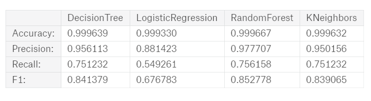

# Predictig-fraud-using-transactions-data

The prediction task is to predict if the transaction is a fraud using the transaction information.
We will create our models using a synthetic dataset of mobile money transactions. 

This dataset is scaled down 1/4 of the original dataset which is presented in "PaySim: A financial mobile money simulator for fraud detection".  https://www.kaggle.com/ntnu-testimon/paysim1

### THE DATA 

Attributes:
step (numerical): Unit of time in the real world. 1 step is 1 hour.

type (categorical): CASH-IN, CASH-OUT, DEBIT, PAYMENT and TRANSFER

amount (numerical): amount of the transaction

nameOrig: customer who started the transaction

oldbalanceOrg (numerical): initial balance before the transaction

newbalanceOrig (numerical): customer's balance after

nameDest: recipient ID of the transaction.

oldbalanceDest (numerical): initial recipient balance before the transaction.

newbalanceDest (numerical): recipient's balance after

isFraud (boolean): identifies a fraudulent transaction (1) and non fraudulent (0)

isFlaggedFraud (boolean): flags illegal attempts to transfer more than 200.000 in a single transaction.

Number of rows: 6.362620e+06

I decided work with the features:
features = ['amount','oldbalanceOrg', 'newbalanceOrig', 'type, 'oldbalanceDest', 'newbalanceDest', 'isFraud']

The correlation of the features with the 
.png)

### Model results

.png)

